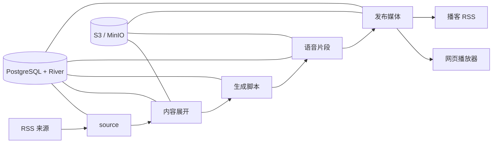

## 本项目相较于原项目，新增了如下内容：

- **订阅功能**：现在你可以订阅其他人的 rss-pod 了
- **暗黑模式**：支持日间、暗黑和跟随系统
- **横向滑动**：分类之间可以滑动切换
- **按分类显示**：页面支持按分类归档
- **预拉取模式**：支持先 poll 文章并显示在页面中，可手动选择下载，继续后续队列任务（优点就是你可以订阅非常多的 RSS，然后自主选择想听哪篇文章）
- **稍后在听**：长按文章可以选择稍后在听，会有一个「稍后在听」的分类单独显示，听后可自动移除，也支持一键清空全部
- **博客置灰**：听过的博客可选择标题置灰，标识已经听过
- **本地缓存**：支持自动预加载下一个博客；也可以让「稍后在听」的文章自动缓存到本地，进入页面时补齐缺失的缓存，已缓存的条目在分类／时间旁显示绿色对勾
- **默认分类**：支持刚进入页面时自动跳转特定的分类
- **首个分类显示**：首个分类可选择显示全部或稍后在听，与默认分类互不影响
- **播放器**：标题跑马灯效果；支持抽屉隐藏
- **文章过滤**：用白名单／黑名单按标题正则表达式筛选来源要处理的文章
- **命令**：新增了一些删除和重试命令

## Docker Pull

```shell
docker pull ghcr.io/leopold7/rss-pod:latest
```

---

<div align="center">
  
  <h1>rss-pod</h1>
  <p><strong>把来不及读的信息，变成路上听得完的播客。</strong></p>
  <p>
    <a href="README.md">English</a>
    ·
    <a href="#快速开始">快速开始</a>
    ·
    <a href="#容器镜像">容器镜像</a>
  </p>
  <p>
    <a href="https://github.com/synrise25/rss-pod/actions/workflows/ci.yml"></a>
    <a href="https://github.com/synrise25/rss-pod/pkgs/container/rss-pod"></a>
    
    <a href="LICENSE"></a>
  </p>
</div>

信息不断涌来，真正能留给阅读的时间却越来越少。rss-pod 把你关心的 RSS 内容整理成自然的多人对话播客，让通勤、开车和散步的时间，变成轻松了解世界的一段声音。

不用盯着屏幕，也不必逐篇追赶——戴上耳机，把纷繁的信息交给路上的时间。


rss-pod 是一个用 Go 编写的 RSS 转播客应用。它会展开 RSS 内容，通过兼容 OpenAI
协议的 LLM 生成结构化多人对话脚本，再使用 Edge TTS 或 Azure Speech 合成音频，
将媒体发布到 S3/MinIO，并同时提供播客 RSS 与轻量网页播放器。

业务状态和后台任务保存在 PostgreSQL 与 River 中。进程重启或外部服务临时失败后，
节目可以从已经完成的阶段继续，不需要整条链路从头生成。

> [!NOTE]
> rss-pod 目前仍是早期自托管项目。迁移和配置都采用显式操作；公开示例配置中的
> RSS 来源默认全部关闭，避免意外调用外部或付费服务。

## 项目缘起

本项目受到 [Zenfeed](https://github.com/glidea/zenfeed) 启发。Zenfeed 是一个功能完整、
能力很强的 RSS + AI 项目；但在实际使用中，我更希望有一个范围更聚焦、围绕自己的自托管播客流程设计的实现：Zenfeed 的部分扩展能力并非我的必需项，而我对任务编排、收听体验等又有一些不同需求，于是有了 rss-pod。

## 主要能力

- 支持直接 RSS、派生 RSS、Jina 和 Crawl4AI 内容展开
- 支持多个兼容 OpenAI 协议的 LLM，并按顺序回退
- 可复用的双人对话角色配置和严格脚本校验
- 支持 Edge TTS、Azure Speech 与 Azure MultiTalker
- PostgreSQL + River 持久任务、自动重试和断点续跑
- 使用 S3/MinIO 保存原文、中间产物和最终媒体
- 公共只读播放器与回环管理 API 分离
- 一个静态 Go 二进制和一个多架构容器镜像

## 工作流程



## 快速开始

### 前置条件

- Go 1.26.2 或兼容的新版本工具链
- PostgreSQL
- MinIO 等兼容 S3 的对象存储
- 至少一个兼容 OpenAI 协议的 LLM 服务
- Edge TTS 和/或 Azure Speech

如果还没有兼容 OpenAI 协议的 LLM 服务，可以试试
[硅基流动](https://cloud.siliconflow.cn/i/eMg5g29e)。通过这个推广链接注册并完成实名认证后，
你和项目维护者都可以获得 16 元平台额度；对于个人测试和轻量使用，通常可以用很久。

复制本地配置：

```bash
cp config.example.yaml config.yaml
cp .env.example .env
```

填写自己的服务地址和凭据，然后执行：

```bash
go test ./...
go run ./cmd/rss-pod check
go run ./cmd/rss-pod migrate
go run ./cmd/rss-pod run
```

公共播放器监听 `:8080`。健康检查和管理接口监听 `127.0.0.1:8081`，不会出现在
公共 listener 上。播放器会在 `/` 根据浏览器首选语言跳转到稳定的英文地址 `/en` 或
简体中文地址 `/zh-cn`；页面语言切换会保留当前查询参数。

### 管理员页面与隐藏节目

可选管理员页面与播放器使用相同端口，入口是 `/admin`（中文），也支持 `/admin/en` 和
`/admin/zh-cn`。未设置密钥时，页面和 `/api/v1/admin/*` 接口均不启用。
三个入口带末尾 `/` 时，会自动重定向到无末尾斜杠的地址，并保留查询参数。
它独立于仅回环可访问的运维管理 API，不会开放服务配置或任务重试等运维接口。

升级后先执行 `rss-pod migrate`，再为 `serve` 或 `run` 注入环境变量并重启：

```dotenv
RSS_POD_ADMIN_TOTP_SECRET=<自行生成的 Base32 密钥>
```

无需配置网站地址：主页是 `https://example.com`，管理员入口自动就是
`https://example.com/admin`。服务根据当前请求校验同源，写操作仍需 CSRF token。
线上使用 HTTPS，本机开发允许 `http://localhost:8080` 或回环 IP。反向代理保留原始
`Host`，并将 `/admin`、`/admin/*` 和 `/api/v1/admin/*` 转发给播放器端口即可。

可在自己的终端生成密钥，然后存入被忽略的 `.env` 或 secret manager：

```bash
python3 -c 'import base64, secrets; print(base64.b32encode(secrets.token_bytes(20)).decode())'
```

在验证器中手动添加账户，填入同一密钥，选择基于时间的 **SHA-1、6 位数字、30 秒**。
登录仅需输入动态码；这是 TOTP 单因素登录，并非密码加动态码的双因素认证。
会话有效期为 30 分钟，Cookie 使用 HttpOnly、SameSite 和 HTTPS Secure 属性；
写操作校验来源及 CSRF token。每个密钥每分钟最多尝试 5 次，已成功使用的动态码不能
再次登录，限流与防重放状态保存在 PostgreSQL 中并由多个实例共享。
保持服务器时间同步；遗失验证器时，在服务器更换密钥并重启即可重新配置，也会让旧会话失效。

登录后复用主页的日期、来源筛选和播放卡片，每条节目多出“隐藏／恢复显示”按钮：

- 隐藏后，节目不再出现在公共播放器和 Podcast RSS 中；管理员仍能看到“已隐藏”状态并恢复。
- 原文、脚本、音频与 RSS 去重记录保留，日常重复抓取不会重新生成这条节目。
- 隐藏不延长原有保留期限；当前数据库回收阈值为 10 天，音频仍遵循对象存储生命周期。
- 隐藏是可逆的内容管理操作，不是文件访问控制；已有音频直链、已下载内容或客户端缓存不会被撤回。

### 播放器通知

播放器可以在页面标题与日期标签之间显示一段 Markdown 通知。先复制示例并按需修改：

```bash
cp notice.example.md notice.md
```

再在 `config.yaml` 中设置文件路径：

```yaml
runtime:
  http:
    notice_file: notice.md
```

`notice_file` 留空、配置的文件不存在，或文件内容为空时，都不显示通知。服务会在
每次页面载入时重新读取文件，因此修改 `notice.md` 后刷新页面即可看到新内容，
不需要重新构建镜像。支持 CommonMark 与表格、删除线、任务列表等 GitHub Flavored
Markdown 语法；出于安全考虑，Markdown 中的原始 HTML 不会执行。通知文件最大为 64 KiB。

通知可以通过右侧的关闭按钮隐藏。播放器会在当前站点的浏览器本地存储中记录通知内容指纹；
只要通知内容没有变化，之后打开页面时都会保持隐藏。通知更新、清理站点数据，或页面载入时检测到
通知已移除或为空，都会清除关闭状态。该状态按浏览器和设备独立保存；禁用本地存储时，关闭只对当前页面有效。

### 播放器主题

播放器默认跟随设备的配色方案。语言切换与仓库链接之间的按钮在跟随系统、浅色、深色之间循环，
选择保存在当前站点的浏览器本地存储中；清理站点数据或换一个浏览器打开，就会回到跟随设备。
主题会在首次绘制前应用，配置下面这项即可隐藏该按钮：

```yaml
runtime:
  http:
    theme_toggle: false
```

### 播放器设置

语言切换左侧的设置按钮会打开一个面板，集中放置保存在当前浏览器里的偏好：

- **主题设置**：跟随系统、日间模式、暗黑模式。面板与标题栏的主题切换按钮共享同一个选择，
  `theme_toggle: false` 时两者一起隐藏。
- **显示设置**：按日期（默认）或按分类。按分类时顶部标签由日期换成各个来源，列表展示该来源
  最近三天的全部条目，行内来源名的位置改为文章发布日（今天／昨天／前天加时间），
  因为列表本身只覆盖三天。两种布局下来源都排在同一行里（按分类时是顶部页签，按日期时是
  页签下方的来源行），放不下时该行横向滚动、末端渐隐，并在右侧出现一个按钮，
  一次列出全部、稍后在听以及所有分类，每一项都带上条数。该按钮默认显示，可在同一面板里关闭，
  关闭后该行只保留横向滚动。

播放器底部同时是一个抽屉：右上角的手柄可以把它收成只保留播放键与当前标题的窄条，
把剩余屏幕让给节目列表。收起状态与其它偏好一样保存在当前浏览器里。

节目列表也可以左右翻页，一页对应一个页签：滑动会先走完当前日期的各个来源，再接到下一个日期
（按分类时页签本身就是来源，逐页移动即可），点页签则直接跳到它对应的那一页。翻页用内嵌的
Swiper 实现，不依赖 CDN（见 `web/vendor/swiper/NOTICE.md`）。

### 仅做拉取的来源

来源可以只负责发现内容。开启后拉取只入库、不再自动生成，播放器会照常列出这些文章的标题，
但把播放按钮换成下载按钮，由听众逐条点击后才开始生成；生成期间该行显示当前阶段，刷新页面后
状态依然可见：

```yaml
sources:
  - id: zhihu-daily
    poll_only: true
```

默认关闭，保持全自动流水线。播放器只展示最近三天，更早的待下载条目可用
`rss-pod start --sources all` 开始。

### 文章过滤

来源可以从内容较多的 feed 里只挑出想听的文章。`filter` 下用 `whitelist` 或 `blacklist`
二选一（同时使用会被配置校验拒绝），每条规则声明读哪个字段（目前只有 `type: title`）和对应
的正则表达式。条目命中任意一条规则即算匹配，正则不加锚点，所以 `财新|独家` 会匹配标题里
出现任意一个词的条目：`whitelist` 保留命中的条目，`blacklist` 丢弃命中的条目。

```yaml
sources:
  - id: caixinwang
    filter:
      # 只保留标题含“财新”或“独家”的文章
      whitelist:
        - type: title
          regex: "财新|独家"
```

```yaml
sources:
  - id: caixinwang
    filter:
      # 丢弃标题含“人事观察”的文章
      blacklist:
        - type: title
          regex: "人事观察"
```

不配置 `filter`，或声明的列表里没有规则，来源会处理 feed 返回的全部条目。过滤在每轮上限
`max_feed_items_per_run` 之前生效，因此额度只花在该来源想要的文章上；规则类型或正则写错、
`whitelist` 与 `blacklist` 同时配置时，`check` 会直接报错。

### 来源标识

来源可以给自己产出的节目打一个标识，列表不用点开就能看出这集是什么。`tag_texts` 是一份
共享的标识文案词典，按播放器支持的语言分别书写；规则用 key 引用其中一条，因此多个来源可以
共用同一段文案。

`defaults.tag` 给所有来源一条规则，来源可以用自己的 `tag` 整块替换它；声明空的 `tag:` 块
则该来源不显示标识。目前只有 `length` 一种规则类型，按该集对应文章的字符数判断：

```yaml
tag_texts:
  long_article:
    en: Long read
    zh-CN: 长文章

defaults:
  tag:
    type: length
    # 文章达到 500 字符时标为长文章。
    value: 500
    text: long_article

sources:
  - id: jikeai
    # 该来源替换默认规则：从 1000 字符起才算长文章。
    tag:
      type: length
      value: 1000
      text: long_article
```

标识跟随页面语言显示：播放器优先取与页面语言（`en`、`zh-CN`）一致的条目，其次取该语言的
主语言（`zh`），再取 `en`，最后取词典里的任意一条。`defaults.tag` 和来源 `tag` 都不配置时
不显示任何标识，行为与之前完全一致。规则类型写错、`value` 不是正数、`text` 引用了不存在的
`tag_texts` 条目，或 `tag_texts` 条目里没有任何文案时，`check` 会直接报错。

字符数取自拉取时入库的文章正文：优先 `content`，为空时用 `description`，并去掉 HTML 标签，
因此阈值比较的是读者能看到的字数。镜像订阅没有自己的文章正文，因此不会被打标。

### 订阅

订阅用于镜像另一个 rss-pod 部署。它不读取 RSS，而是按自己的计划定时拉取对方的公开播放器
接口，取回对方自上次运行以来发布的节目并转载到本站，使本站的播放器、来源筛选和播客 RSS
也能收录别人的播客：

```yaml
subscriptions:
  - id: peer-podcast
    name: 朋友的播客
    enabled: true
    # 对方部署的站点地址，接口路径会自动拼接。
    base_url: https://pod.example.com
    # 指定对方部署中的某个来源；留空表示镜像对方提供的全部来源。
    source_id: zhihu-daily
    # 拉取窗口：结束于本次运行时刻，开始于上一次运行结束的位置。
    schedule:
      cron: "0 8 * * *"
    lookback: 72h
    limit: 200
```

首次拉取覆盖 `lookback` 指定的时间窗；之后每轮都从上一次成功运行的位置继续，并重叠一小时，
因此只会重复上一轮窗口的尾巴。`id` 会成为被镜像条目的 `source_id` 和播放器筛选项名称，
不能与 source id 重复；`check` 会为每个启用的订阅拉取一页，提前暴露对方地址或来源配错。

镜像引用远端音频 URL 而不是复制文件：没有下载、不会在本地重新生成，被镜像的节目一入库
即可播放。被镜像的条目保留对方的文章日期，因此按日期布局时它会分到那篇文章所属的那一天。
只有对方已经生成好音频的条目才会被镜像，尚未生成完的条目会在后续拉取时补上。由于音频仍在
对方部署上，对方依旧是它的负责人：删除远端对象或隐藏远端节目不会移除本站已镜像的副本，
保留多久也是对方窗口决定的，而不是本站的。

播放器的来源筛选默认按配置顺序列出：先来源、后订阅，横向翻页的顺序与之一致。`order` 用来
在这个列表里指定位置：`1` 表示排在最前；不填写的条目保持配置顺序，填补已排序条目留下的位置；
`order` 超出条目总数时按最后一位处理。来源与订阅共用同一个筛选，因此两个条目写同一个位置也
没有问题：后一个会自动顺延到下一个空位；中间跳过的号同样不会留下空格，空位交给不填 `order`
的条目，筛选里不会出现空条目。关闭的条目只是保留该值，不参与这个列表。

主要命令：

| 命令 | 用途 |
| --- | --- |
| `check` | 校验配置和外部服务 |
| `migrate` | 执行应用及 River 数据库迁移 |
| `poll` | 手动创建一个或多个来源或订阅拉取任务 |
| `start` | 开始 poll_only 来源中等待下载的条目 |
| `retry` | 从失败的阶段重新入队失败的节目 |
| `stop` | 取消全部在途任务并中止它们的工作 |
| `delete` | 彻底清除失败的节目及其正文、音频和拉取记录（`--include-waiting` 同时清除 poll_only 来源中等待下载的条目） |
| `serve` | 只运行 HTTP 播放器和管理 listener |
| `worker` | 只执行指定 River 队列 |
| `run` | 同时运行 HTTP、调度器和全部队列 |

## Docker

本地构建：

```bash
docker build -t rss-pod:dev .
```

先迁移数据库，再启动默认的单容器模式：

```bash
docker run --rm \
  --env-file .env \
  --volume "$PWD/config.yaml:/app/config.yaml:ro" \
  rss-pod:dev migrate --config /app/config.yaml

docker run --detach \
  --name rss-pod \
  --restart unless-stopped \
  --publish 127.0.0.1:8080:8080 \
  --env-file .env \
  --volume "$PWD/config.yaml:/app/config.yaml:ro" \
  rss-pod:dev run --config /app/config.yaml
```

配置了 `notice_file: notice.md` 时，在启动命令中再增加这一项只读挂载：

```bash
--volume "$PWD/notice.md:/app/notice.md:ro" \
```

如果维护了部署专用 Prompt，也可以把本地 `prompts/` 只读挂载到容器。

## 容器镜像

GitHub Actions 会在每次 pull request 和推送到 `main` 时运行测试、静态检查及
Docker 构建。创建符合 `v*.*.*` 的版本标签后，会自动发布 `linux/amd64` 和
`linux/arm64` 镜像到：

```text
ghcr.io/synrise25/rss-pod
```

发布标签包括完整语义版本、主次版本以及 `latest`。镜像成功发布后，工作流还会自动创建
同名 GitHub Release，并生成版本说明。

## 配置

- [`config.example.yaml`](config.example.yaml)：带中英双语注释的公开配置参考；使用前复制为
  被忽略的 `config.yaml`
- [`notice.example.md`](notice.example.md)：播放器 Markdown 通知示例；使用前复制为被忽略的
  `notice.md`
- [`.env.example`](.env.example)：配置文件所引用的环境变量
- [`CONTRIBUTING.md`](CONTRIBUTING.md)：开发与贡献说明

真实凭据只应通过环境变量或 secret manager 注入。不要提交 `.env` 或真实部署使用的
`config.yaml`。

Crawl4AI 支持 `md`（默认，调用 `/md`）和 `crawl`（调用 `/crawl`）两种模式。`filter`
只在 `md` 模式下选择 `raw` 或 `fit`；`crawl` 模式必须配置一个 transform，避免未处理的
HTML 被直接送入 LLM。
`services.content.jina` 与 `services.content.crawl4ai` 提供全局默认值；其中
`services.content.jina.base_url` 未填写或为空时回退到内置默认值 `https://r.jina.ai`，
可通过 `JINA_BASE_URL` 指向自建 Jina，无需修改配置文件。source 可以在
`content.jina` 或 `content.crawl4ai` 下覆盖对应 service 的任意字段，包括显式使用空字符串
关闭全局代理。建议凭据覆盖仍通过 `env://` 注入。

V2EX 主题可以使用 `crawl` 模式和内置的 `v2ex-topic` transform：

```yaml
content:
  type: crawl4ai
  url:
    from: item.link
  crawl4ai:
    mode: crawl
  transform:
    type: v2ex-topic
```

该 transform 从网页 HTML 提取标题、原帖、全部分页回复及页面上可见的回复感谢数，去重后
合并为一个 Markdown Document，不依赖 V2EX API。`max_documents_per_item` 只限制派生 RSS
生成的 Document 数量，不限制这个 Document 内的回复数。送入 LLM 的资料达到应用层
120,000 字符上限时会截断，并输出一条不含正文和 URL 的 warning 日志。

## 安全边界

公共 listener 提供播放器及其 `/api/v1/player/*` 路由。这些路由只读取数据，
唯一的例外是 `POST /api/v1/player/episodes/{id}/start`：它用于开始生成 poll_only 来源中
等待下载的节目，因此不带鉴权，任何能访问播放器的人都能触发内容抓取和 TTS 调用，
只做下载的部署请放在可信网络内。设置管理员环境变量后，会额外启用 TOTP 登录保护的
`/admin` 和 `/api/v1/admin/*`，仅用于节目隐藏与恢复。健康检查、手动拉取、重试、
数据库查询和播客管理接口只绑定回环 listener。不要把容器管理端口映射到宿主机公网，
也不要让反向代理转发它。

## 许可证

本项目使用 [MIT License](LICENSE)。
